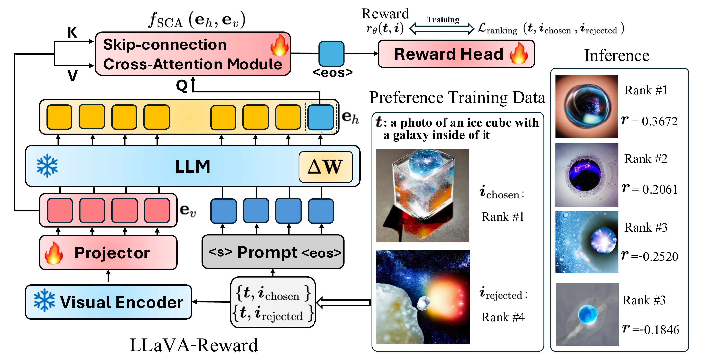
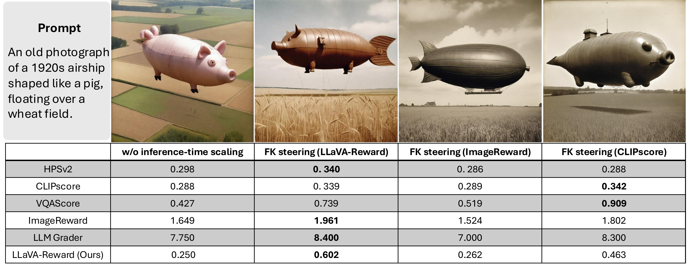
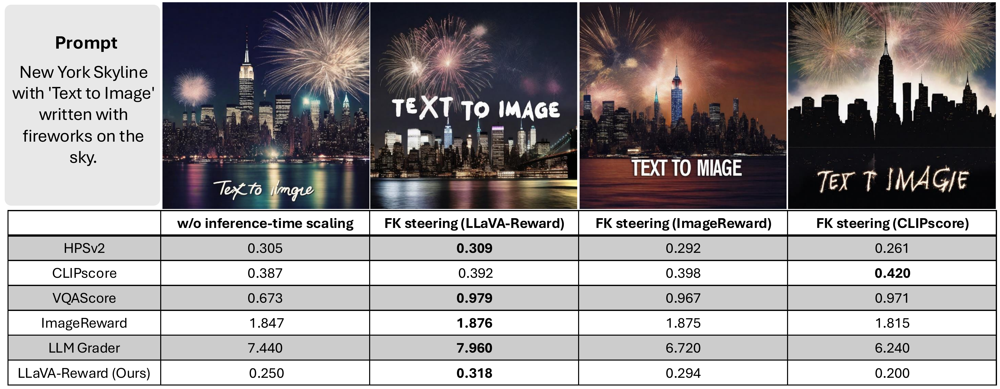

# LLaVA-Reward
Multimodal LLMs as Customized Reward Models for Text-to-Image Generation (ICCV 2025)

<h4>
<a href="https://arxiv.org/abs/2507.21391">📄 arXiv Paper</a> &nbsp; 
<a href="https://huggingface.co/smz8599/LLaVA-Reward/tree/main">🤗 Models</a> &nbsp;
</h4>

### Model Architecture Overview

## Installation 
```bash
git clone https://github.com/sjz5202/LLaVA-Reward
cd LLaVA-Reward
conda create -n llavareward python=3.10
conda activate llavareward
conda install pytorch==2.3.0 torchvision==0.18.0 torchaudio==2.3.0 pytorch-cuda=12.1 -c pytorch -c nvidia
pip install -e .
```

## Quick Start
Example usage (also available at `eval/simple_inference.py`):
```python
import torch
from eval.reward_adaptor_loader import load_reward_adaptor, inference_process_phi3v, preference_compute
import os

class Args:
    pass
args = Args()
args.pm_path = "/code/llava-reward-ckpt/alignment/llavareward_phi_alignment"
args.pretrain = "microsoft/Phi-3.5-vision-instruct"
args.cache_dir = None
args.ft_projector = True
args.seed = 1234
args.disable_fast_tokenizer = False

# load model
args, model, processor, tokenizer = load_reward_adaptor(args,model_type='phi3v',reward_config_path=os.path.join(args.pm_path, "reward_config.yaml"),load_tokenizer=True)
model.to('cuda')
model.eval()

# prepare example
caption = "perfect white haired egyptian goddess wearing white dove wings, warframe armor, regal, attractive, ornate, sultry, beautiful, ice queen, half asian, pretty face, blue eyes, detailed, scifi platform, 4 k, ultra realistic, epic lighting, illuminated, cinematic, masterpiece, art by akihito tsukushi, voidstar"
img_dir_list = ["data/sample_test/sample_img/0_1_id_000904-0035.jpg", "data/sample_test/sample_img/4_3_id_000904-0035.jpg"]
img_inputs = inference_process_phi3v(args,processor,tokenizer,img_dir_list,caption,device='cuda')
img_inputs_c = img_inputs[0]
img_inputs_r = img_inputs[1]

# inference
with torch.no_grad():
    chosen_rewards, _ = model.custom_forward(**img_inputs_c)
    reject_rewards, _ = model.custom_forward(**img_inputs_r)
prob = preference_compute(args,chosen_rewards,reject_rewards)

if not args.is_general_preference:
    print("image0 reward:", chosen_rewards.item())
    print("image1 reward:", reject_rewards.item())
print('Predict probability that image0 is better than image1:',prob)
```

## Evaluation
Eval data preparation such as MJ-Bench.
`./eval/` contains corresponding evalutions for LLaVA-Reward with different MLLM backbones. You can try LLaVA-Reward with your few samples using `bash eval/batch_inference_rm_phi_user_input.sh`. 


## Reformated training data
In `data/`, we provide the reformated training data from ImageReward and UnsafeBench. We also include sample test data in `data/sample_test`, providing data format for pairwise and non-pairwise test data. 


## Training
`scripts/` contains training scripts.
- Loss variants: BT/GPM/CLS (please note GPM mode needs pair-wise image as inputs)
- Architecture: with and without SkipCA
- Different backbones: Phi-3.5-v, Qwen2.5-VL and LLaVA-v1.6.
### Example Training script
```
# phi3 gpm lora
deepspeed train_rm_general_preference.py \
     --save_path your-path \
     --save_steps 2 \
     --logging_steps 1 \
     --eval_steps 10000 \
     --accumulated_gradient 4 \
     --micro_train_batch_size 4 \
     --pretrain microsoft/Phi-3.5-vision-instruct \
     --bf16 \
     --max_epochs 3 \
     --max_len 2048 \
     --zero_stage 3 \
     --learning_rate 2e-4 \
     --general_preference_tau 0.1 \
     --dataset your-json \
     --dataset_probs 1 \
     --flash_attn \
     --gradient_checkpointing \
     --group_size 1 \
     --value_head_dim 2 \
     --save_best_model 2 \
     --train_split_ratio 1 \
     --freeze_vision_model \
     --lora_rank 128 \
     --lora_alpha 256 \
     --ft_projector \
     --add_cross_attention \
     --is_general_preference \
     --lora_dropout 0.05
```

## Checkpoints
We provide checkpoints for text-to-image alignment, fidelity, safety evaluation and checkpoints for general T2I rewarding. You can find them at [LLaVA-Reward](https://huggingface.co/smz8599/LLaVA-Reward/tree/main). 

To perform inference, Use the evaluation scripts in `eval/`. Please ensure that the script names align with the backbones of selected checkpoints.

## Examples of inference-time scaling generations ([Fk-Diffusion-Steering](https://github.com/zacharyhorvitz/Fk-Diffusion-Steering)) using LLaVA-Reward



## Acknowledgement
LLaVA-Reward is mainly based on [GPM](https://github.com/general-preference/general-preference-model), [OpenRLHF](https://github.com/OpenRLHF/OpenRLHF).

## Citation

```
@misc{zhou2025multimodalllmscustomizedreward,
      title={Multimodal LLMs as Customized Reward Models for Text-to-Image Generation}, 
      author={Shijie Zhou and Ruiyi Zhang and Huaisheng Zhu and Branislav Kveton and Yufan Zhou and Jiuxiang Gu and Jian Chen and Changyou Chen},
      year={2025},
      eprint={2507.21391},
      archivePrefix={arXiv},
      primaryClass={cs.CV},
      url={https://arxiv.org/abs/2507.21391}, 
}
```
